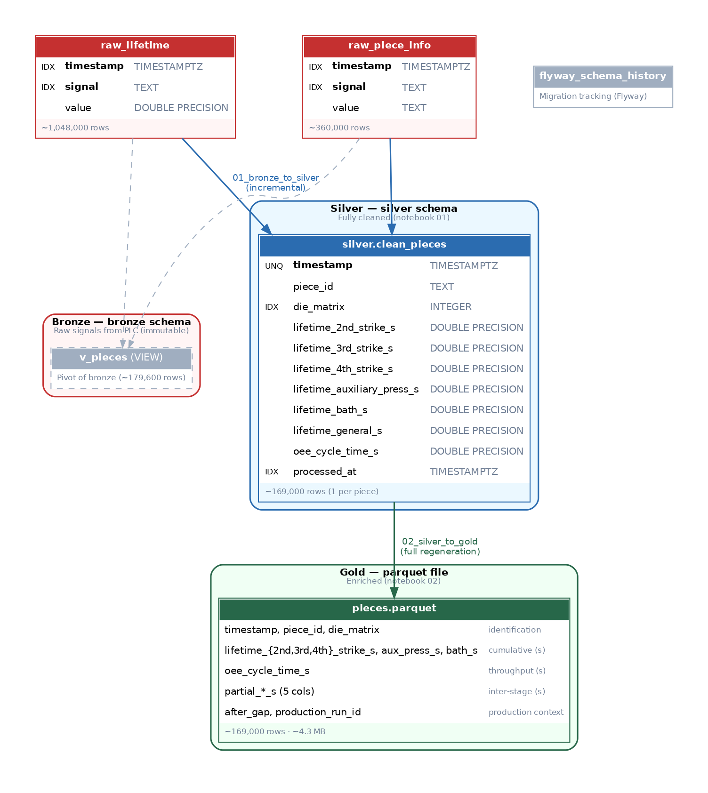

# Data Architecture

This document explains the strategy used to organize, clean, and prepare the forging line data for analysis and machine learning. It covers the medallion architecture, the reasoning behind each design decision, and how the pipeline is implemented.

## The problem

The forging line PLC captures ~1.4 million signal readings across 6 lifetime signals and 2 identification signals. This raw data contains:

- A signal that is incorrectly calculated at the source (upsetting)
- ~1.2% tracking failures (zero values)
- Extreme outliers from stuck pieces and unclosed cycles (values 10–27× the normal range)
- Duplicate timestamp readings
- ~16% missing 4th strike (drill) sensor data for a specific period

This data cannot be used directly for analysis or ML. It needs to be cleaned — but the cleaning must be structured so that raw data is preserved, cleaning rules are auditable, and the pipeline can run incrementally as new production data arrives.

## Medallion architecture

We use a three-layer medallion architecture (bronze / silver / gold) to separate concerns:



### Bronze — raw, immutable signals

**Storage**: PostgreSQL `bronze` schema (`raw_lifetime`, `raw_piece_info`)

Bronze is the data exactly as the PLC captures it. No transformations, no filtering, no pivoting. Every signal reading is preserved with its original timestamp, signal name, and value.

**Why keep raw data untouched?**

- If a cleaning rule turns out to be wrong, we can re-derive silver and gold without going back to the PLC
- The raw signal format (timestamp / signal / value) is how the PLC naturally emits data — forcing a different structure at ingestion would add fragile transformation logic to the data capture layer
- It serves as the audit trail: we can always verify what the sensors actually reported

### Silver — cleaned, pivoted, one row per piece

**Storage**: PostgreSQL `silver` schema (`silver.clean_pieces`)

Silver takes the raw signals, applies **all cleaning rules** (both signal-level and piece-level), pivots them from the tall signal/value format into a wide one-row-per-piece format, and joins piece identification (piece_id, die_matrix) with travel times. Silver contains **only valid pieces**.

**What happens at this stage:**

| Step | What it does | Why |
|---|---|---|
| Drop upsetting signal | Excludes all readings from the incorrectly calculated PLC signal | This signal is broken at the source — no amount of cleaning can fix it |
| Remove zero values | Drops any reading where value = 0 | Zeros are tracking failures, not real measurements |
| Deduplicate timestamps | Keeps only the last reading per signal per timestamp | PLC occasionally double-registers the same piece |
| Pivot + join | Transforms signal/value pairs into one row with all stages as columns | The wide format is what every downstream consumer needs |
| Drop missing identification | Removes rows without piece_id or die_matrix | A piece without identification cannot be segmented by matrix |
| Remove extreme outliers | Q3 + 3×IQR per signal, per die matrix | Values 10–27× the normal range are stuck pieces or unclosed cycles, not slow pieces |
| Validate monotonic order | Ensures 2nd strike < 3rd strike < 4th strike < bath | Catches sensor misattributions and PLC timing errors |
| Compute OEE cycle time | Rolling avg of 5 inter-piece intervals, NULL if outside 11–16s | Approximates the PLC's auxiliary press throughput metric from timestamps |

**Why silver stays in PostgreSQL (not in a file)?**

- It needs to be queryable by the Streamlit app and ad-hoc SQL without loading files
- PostgreSQL handles the incremental append natively (INSERT with conflict avoidance on the unique timestamp index)
- When we migrate to AWS RDS, silver is just another table in the same database — no file storage infrastructure needed

**Why silver is incremental:**

The `01_bronze_to_silver` notebook tracks the latest timestamp in `silver.clean_pieces` and only processes bronze rows after that point. This makes it efficient for scheduled execution — processing a day's worth of new production (~3,000 pieces) takes seconds, not minutes.

### Gold — enriched, portable

**Storage**: Parquet file (`data/gold/pieces.parquet`)

Gold takes the already-clean silver data and **enriches** it with computed features for analytics and ML. No additional cleaning happens here — silver already contains only valid pieces.

| Step | What it does | Why |
|---|---|---|
| Compute partial times | Subtracts consecutive cumulative times to get inter-stage durations | These are the key diagnostic values for delay analysis |
| Mark production gaps | Flags pieces after intervals > 5 minutes | Prevents time-series analysis from interpolating across stops |

**Why gold is a parquet file (not a database table)?**

- ML training (XGBoost, SageMaker) reads parquet natively — no database connection needed
- Parquet is columnar and compressed (~3.8 MB for 169k rows vs ~25 MB as CSV)
- It's portable: can be uploaded to S3, shared with collaborators, or versioned alongside code
- Notebooks load it with a single `pd.read_parquet()` — no connection strings, no SQL

**Why gold regenerates fully (not incrementally)?**

Production run IDs depend on the global ordering of all pieces. Adding new data changes run boundaries. Regenerating from silver (~169k rows) takes a few seconds, so the cost is negligible.

## Pipeline implementation

The pipeline is implemented as two Jupyter notebooks designed to run in AWS SageMaker Unified Studio Workflows. For now, they are executed manually.

### `notebooks/01_bronze_to_silver.ipynb`

**Mode**: Incremental

1. Queries `MAX(timestamp)` from `silver.clean_pieces` to find the watermark
2. Reads bronze rows after the watermark, excluding upsetting signal and zero values
3. Deduplicates timestamps per signal
4. Pivots lifetime signals into columns and joins with piece identification
5. Drops rows missing piece_id or die_matrix
6. Removes extreme outliers (Q3 + 3×IQR per signal per die matrix)
7. Validates monotonic cumulative order (2nd strike < 3rd strike < 4th strike < bath)
8. Computes OEE cycle time (rolling avg of 5 inter-piece intervals, NULL if outside 11–16s)
9. Appends validated pieces to `silver.clean_pieces`
10. Prints a cleaning report with counts and justifications

### `notebooks/02_silver_to_gold.ipynb`

**Mode**: Full regeneration

1. Reads the complete `silver.clean_pieces` table
2. Removes outliers (Q3 + 3×IQR per signal per die matrix)
3. Validates monotonic cumulative order per piece
1. Reads the complete `silver.clean_pieces` table
2. Computes partial times between stages
3. Identifies production gaps and assigns run IDs
4. Exports to `data/gold/pieces.parquet`

### Execution order

```
1. Run 01_bronze_to_silver  →  silver.clean_pieces updated
2. Run 02_silver_to_gold    →  pieces.parquet regenerated
```

Gold depends on silver being up to date. If silver has not been refreshed, gold will regenerate from stale data (still consistent, but not current).

## Why not clean in SQL?

An alternative would be to implement all cleaning as SQL views or materialized views inside PostgreSQL. We chose notebooks instead for these reasons:

- **Outlier detection** (IQR per matrix) is awkward in SQL but natural in pandas
- **Monotonic validation** across multiple columns per row is verbose in SQL
- **The notebooks will run as SageMaker workflows** — they need to be Python, not SQL
- **Auditability**: each notebook cell shows its input, the transformation, and the output. A SQL view hides the intermediate steps
- **Flexibility**: cleaning rules are expected to evolve as we learn more about the process. Changing a notebook cell is faster than creating new flyway migrations for every rule adjustment

The DDL (table creation, indexes) stays in flyway because schema structure changes rarely. The data transformation logic lives in notebooks because it changes often.

## Data volume at each layer

| Layer | Rows | Size | Format |
|---|---|---|---|
| Bronze (`bronze.raw_lifetime`) | ~1,048,000 | ~125 MB (in PostgreSQL) | signal/value pairs |
| Bronze (`bronze.raw_piece_info`) | ~360,000 | ~37 MB (in PostgreSQL) | signal/value pairs |
| Silver (`silver.clean_pieces`) | ~169,000 | ~14 MB (in PostgreSQL) | 1 row per piece (validated) |
| Gold (`pieces.parquet`) | ~169,000 | ~3.8 MB | 1 row per piece + partials + run IDs |

The 10× compression from bronze to gold reflects both the pivot (8 signal rows → 1 piece row) and the cleaning (removal of bad data).

## Future: AWS migration path

The architecture is designed to migrate to AWS with minimal changes:

| Component | Current (local) | Future (AWS) |
|---|---|---|
| Bronze + Silver database | PostgreSQL in Docker | AWS RDS PostgreSQL |
| Gold parquet | Local file system | S3 bucket |
| Notebooks | Manual execution | SageMaker Unified Studio Workflows |
| Flyway migrations | Docker container | Standalone CLI or CI/CD pipeline |
| PLC data injection | Direct to local PostgreSQL | Direct to RDS (same connection logic) |

The notebooks use `sqlalchemy` connection strings loaded from environment variables. Switching from local to RDS is a configuration change, not a code change.
